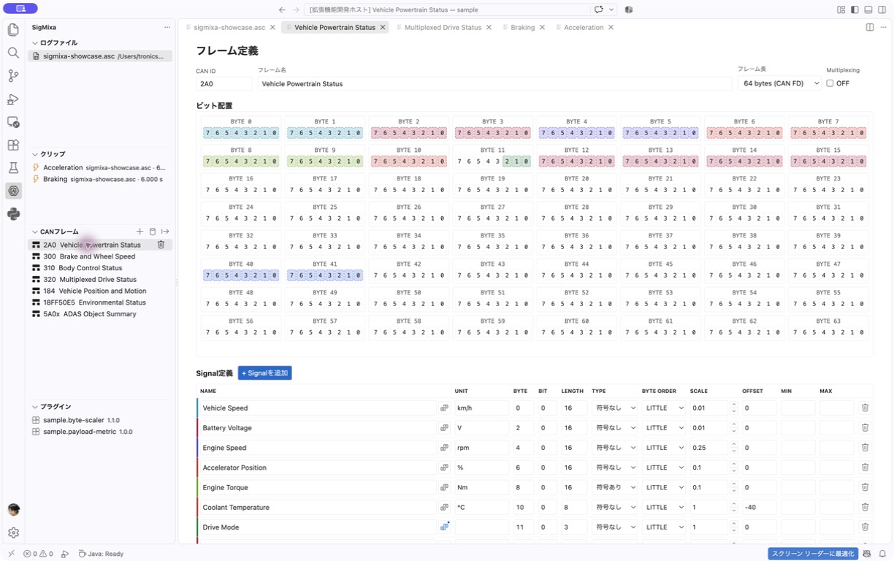
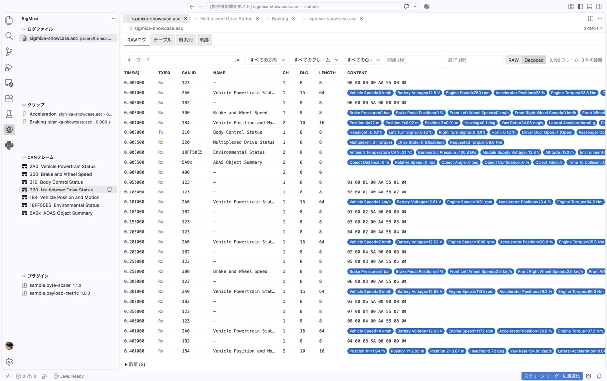
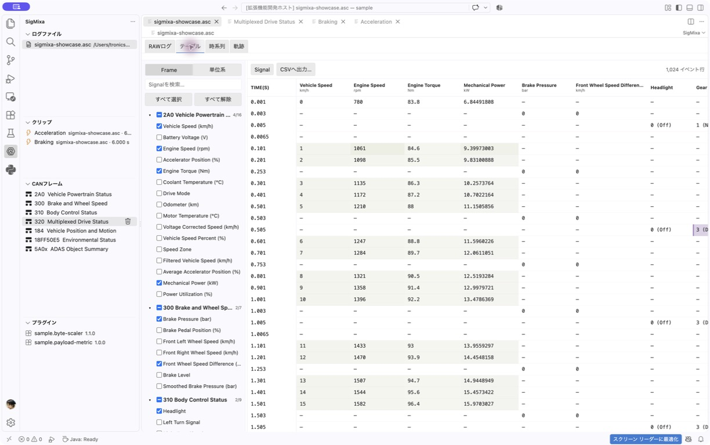
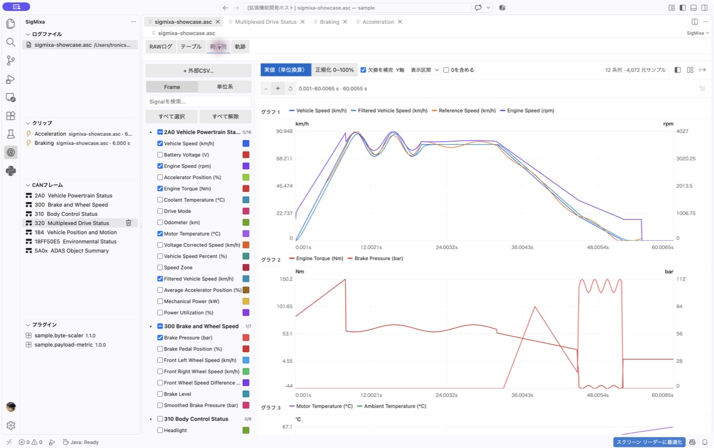
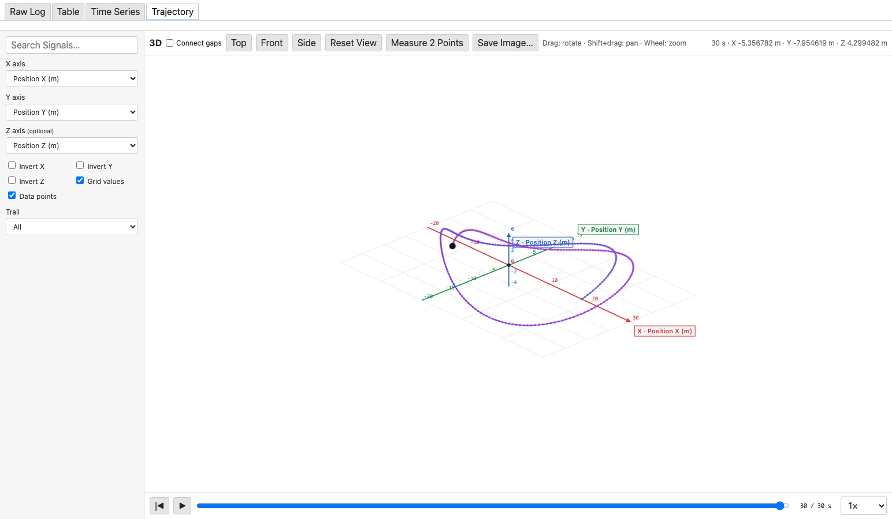

# SigMixa for VS Code

<picture>
  <source media="(prefers-color-scheme: dark)" srcset="media/sigmixa-logo-dark.png">
  
</picture>

SigMixa imports CAN logs, decodes them into Signals, and provides searchable tables and interactive charts directly in VS Code.

## Features

- Vector ASC import for Classic CAN and CAN FD
- Vector BLF import for Classic CAN and CAN FD
- Virtualized RAW Log with search, filters, progress, cancellation and diagnostics
- Resizable columns with Auto Fit and Fit to View
- Configurable Signal Definitions with Intel/Motorola byte order, signed values, Scale/Offset and Multiplexing
- DBC import/export for CAN Frame and Signal definitions
- Derived Signals using expressions, lookup tables, low-pass filters and moving averages
- Signal Table with virtual rows and CSV export
- Time Series with independent timestamps, colors, zoom, pan and CSV overlays
- Synchronized 2D/3D Trajectory with axis controls, trails, camera presets and playback
- Extensible Plugins with configurable Frame bindings and schema-generated settings

## See SigMixa in action

### Define Frames and Signals visually

Configure CAN IDs, frame lengths, bit layouts and Signal decoding rules in one editor, or import the definitions from DBC.

### Inspect and decode every frame

Search and filter virtualized Classic CAN and CAN FD logs while decoded Signal values remain visible beside the original payload.

### Compare decoded Signals as a table

Choose Signals by Frame, inspect their values on independent timestamps and export the visible event rows to CSV.

### Explore behavior over time

Plot multiple Signals with distinct colors, switch between actual and normalized scales, then zoom or pan through the capture.

### Replay synchronized trajectories

Map synchronized Signals such as vehicle Position X, Y and Z onto 2D or 3D axes, adjust the camera and trail, and replay the path against log time.

## Getting started

1. Install the SigMixa VSIX from **Extensions → … → Install from VSIX…**.
2. Open the folder containing your log files in VS Code.
3. Open the SigMixa icon in the Activity Bar.
4. Select **LOG FILES → Open CAN Log** and choose an ASC or BLF file.
5. Add or edit definitions under **CAN FRAMES**, then use RAW Log, Table, Time Series or Trajectory.

Use the database button in **CAN FRAMES** to import `BO_`/`SG_` definitions from
a DBC file. The export button writes one selected Frame or all registered Frames
back to DBC. Existing CAN IDs are never overwritten without confirmation.

Project settings are saved in `.sigmixa/project.json` inside the workspace. This file contains Frame and Signal definitions, Plugin registrations, CSV sources and saved view selections.

## CAN ID notation

- Standard IDs use hexadecimal text such as `123` or `7FF`.
- IDs longer than three hexadecimal digits are treated as extended automatically.
- Add `x` to a short ID when it must be treated as extended, for example `5A0x`.

## Plugins

Use **PLUGINS → +** to select a Plugin package directory. Open a registered Plugin to enable or disable it, manage Frame bindings, edit its settings, reload it or unregister it.

Plugin authors can use the [SigMixa Plugin SDK](docs/plugin-sdk.md). Plugins are local executable code, so install only packages you trust.

## Sample workspace

Open the [`sample`](sample) directory as a VS Code workspace and load `sigmixa-showcase.asc` or `sigmixa-showcase.blf`. The matching showcases cover log parsing, Signal decoding, Derived Signals, Plugins, External CSV, Table, Time Series, Trajectory and diagnostics. See the [sample guide](sample/README.md) for the included scenario.

## Current limitations

- External CSV Signals are available in Time Series, but are not merged into the event-row Table.
- Trajectory axes must come from one source and have exactly matching timestamps.
- Plugin configuration uses SigMixa's standard schema editor; Plugin-specific custom views are not supported.
- DBC multiplexing, negative Scale, value tables, comments and attributes are not yet modeled. Unsupported Signal rows and Derived Signal exports are reported in the **SigMixa DBC** output.

## License

SigMixa, including its original logo and icon assets, is available under the
[MIT License](LICENSE). See [Third-Party Notices](THIRD_PARTY_NOTICES.md) for
third-party components.
