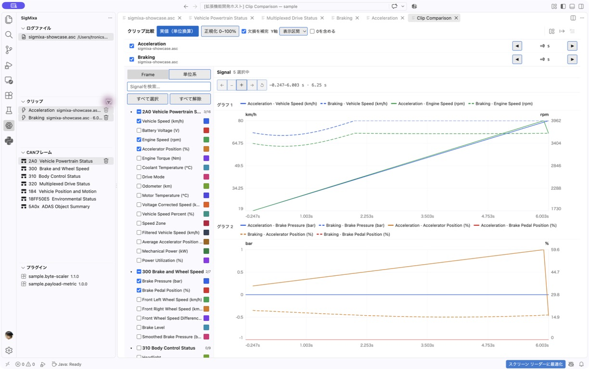

# SigMixa for VS Code

<picture>
  <source media="(prefers-color-scheme: dark)" srcset="media/sigmixa-logo-dark.png">
  
</picture>

SigMixa turns CAN logs into Signals, tables and interactive charts directly in VS Code. Inspect ASC or BLF captures, define decoding rules, replay motion and compare selected intervals across recordings.

All log processing and visualization run locally in the VS Code Extension Host and Webview. SigMixa does not upload captures.

## Features

- Import Vector ASC and BLF for Classic CAN and CAN FD, with progress, cancellation and diagnostics.
- Define Signals visually with Intel/Motorola byte order, signed values, Scale/Offset and Multiplexing; import or export DBC definitions.
- Create Derived Signals with expressions, linear interpolation, low-pass filters and moving averages.
- Inspect virtualized RAW Logs and Signal Tables with filtering, automatic column sizing, multi-row copy, VS Code text-editor integration and CSV export.
- Analyze Time Series with compatible-unit conversion, dual Y axes, drag-and-drop graph layout, zoom, CSV overlays, pinned value markers and SVG/PNG export.
- Follow Derived Signal dependencies in a clickable flow diagram.
- Save intervals as Clips and compare the same or different recordings with Signal selection and CAN Timestamp alignment.
- Replay synchronized 2D/3D Trajectories with coordinate axes, grid values, point inspection, two-point measurements and SVG/PNG export.
- Extend decoding through local Plugins with schema-generated settings.
- Use English or Japanese UI according to your VS Code display language.

## See SigMixa in action

### Define Frames and Signals visually

Configure CAN IDs, frame lengths, bit layouts and Signal decoding rules in one editor, or import the definitions from DBC. Hover or edit a Signal to highlight its bits and MSB/LSB; click a bit to find its definition. Colors follow Signals when rows are reordered. Changes apply automatically. Scale selects arithmetic automatically: power-of-two magnitudes shift integer RAW, apply the Scale sign, then add Offset; other values such as `0.01` retain fractional values. Positive and negative Scale values are supported. Direct conversion uses integer/rational arithmetic before producing the result. Multiplexed Frames show per-Signal activation rules and a switchable bit-layout preview.

Expand a Derived Signal to edit its linear-interpolation table alongside the curve, or inspect a filter's example step response. Editing a table point highlights the matching curve point without reordering the input rows. Double-click a column boundary to fit its contents.

### Inspect and decode every frame

Filter Classic CAN and CAN FD Frames by keyword or regular expression, direction, channel and time. Switch CONTENT between RAW bytes and decoded Signals; undefined Frames retain their RAW payload. Select or drag across rows to copy into Excel or open them in a VS Code text editor.

### Compare decoded Signals as a table

Choose Signals by Frame and inspect their values at the original event timestamps. Reorder or resize columns, copy selected rows, or export the displayed Signals to CSV.

### Explore behavior over time

Plot multiple Signals with distinct colors, switch between actual and normalized scales, then zoom or pan through the capture. Drag unit families between graphs and left/right axes in **Graph Layout**. Hover or pin markers to inspect original samples, not interpolated values from the plotted line. Reference lines snap to the nearest original sample and show its timestamp below the graph. Value labels omit matching timestamps; asynchronous samples show only a compact signed offset such as `@-3ms` (3 ms before the line). Comparison uses time relative to each Clip's alignment anchor. **Connect gaps** affects lines only, not inspected values. Save every graph and legend as scalable SVG or fixed-resolution PNG.

Compatible units share a scale, with the original unit retained when all Signals use it. Mixed units are converted to a common display unit. Up to two unit families share one fixed-height graph; additional graphs scroll vertically. Engineering units include `km/h`, `mph`, `degree`, `rad`, `Nm`, pressure units and both `m/s²` and `m/s^2`. Unknown units stay separate. Gap connection and Y-axis range settings apply across the graphs.

### Save intervals and compare recordings

Drag a time range in Time Series and create a Clip. Saved Clips appear under **CLIPS**, where you can reopen their RAW Log, Table, Time Series or Trajectory, navigate to the source file, or remove a Clip without changing the recording.

Compare Clips from one or several files. The initial Signal selection follows each Clip's graph selection; adjust it in the comparison pane. Align starts one CAN Timestamp at a time, distinguish Clips by line style, customize graph layout, pin values and save the comparison as SVG or PNG.

### Replay synchronized trajectories

Map synchronized Position X, Y and Z Signals onto 2D or 3D axes and replay the path against log time. Top, Front and Side presets use X as forward, Y as right and Z as up. Show grid values and data points, inspect coordinates, or select two points to measure elapsed time, coordinate differences, straight distance, path length and average speed. Save the current view as scalable SVG or fixed-resolution PNG.

### Signal flow

In Frame Definition, use **Signal flow** beside a Derived Signal name. Only its upstream dependencies are shown. Select a node to focus its definition; unresolved inputs are marked rather than connected to an unrelated Signal.

## Getting started

1. Install **SigMixa** from the VS Code Marketplace. A downloaded VSIX can also be installed from **Extensions → … → Install from VSIX…**.
2. Open the folder containing your log files in VS Code.
3. Open the SigMixa icon in the Activity Bar.
4. Select **LOG FILES → Open CAN Log** and choose an ASC or BLF file.
5. Add or edit definitions under **CAN FRAMES**, then use RAW Log, Table, Time Series or Trajectory.

For a guided tour of each analysis view, see the [User Guide](docs/user-guide.md). To explore every main workflow with prepared data and settings, open the [sample workspace](sample).

Use the database button in **CAN FRAMES** to import `BO_`/`SG_` definitions from
a DBC file. The export button writes one selected Frame or all registered Frames
back to DBC. Existing CAN IDs are never overwritten without confirmation.

Project settings are saved in `.sigmixa/project.json` inside the workspace. This file contains Frame and Signal definitions, Plugin registrations, CSV sources, Clips and saved view selections.

## CAN ID notation

- Standard IDs use hexadecimal text such as `123` or `7FF`.
- IDs longer than three hexadecimal digits are treated as extended automatically.
- Add `x` to a short ID when it must be treated as extended, for example `5A0x`.

## Plugins

Use **PLUGINS → +** to select a Plugin package directory. Open a registered Plugin to enable or disable it, manage Frame bindings, edit its settings, reload it or unregister it.

Plugin authors can use the [SigMixa Plugin SDK](docs/plugin-sdk.md). Plugins are local executable code, so install only packages you trust.

## Sample workspace

Open the [`sample`](sample) directory as a VS Code workspace and load `sigmixa-showcase.asc` or `sigmixa-showcase.blf`. The matching showcases cover log parsing, Signal decoding, Derived Signals, Plugins, External CSV, Table, Time Series, Trajectory and diagnostics. See the [sample guide](sample/README.md) for the included scenario.

## Compatibility notes

- External CSV Signals are available in Time Series, but are not merged into the event-row Table.
- Trajectory axes must come from one source and have exactly matching timestamps.
- Plugin configuration uses SigMixa's standard schema editor; Plugin-specific custom views are not supported.
- DBC Signal value labels (`VAL_`) are imported and exported. Edit them from the value-label button beside a Signal name; labels match RAW integers before Scale/Offset. RAW Log, Table and chart markers show the label alongside the numeric value. CSV exports remain numeric.
- DBC Frame/Signal definitions, Intel/Motorola byte order, signedness, Scale/Offset, limits, units, standard/extended IDs, Multiplexing and direct value labels are supported. DBC-only metadata such as comments, attributes and reusable named value tables (`VAL_TABLE_`) is not retained. Derived Signal operations cannot be represented in standard DBC and are reported during export.

## License

SigMixa, including its original logo and icon assets, is available under the
[MIT License](LICENSE). See [Third-Party Notices](THIRD_PARTY_NOTICES.md) for
third-party components.
